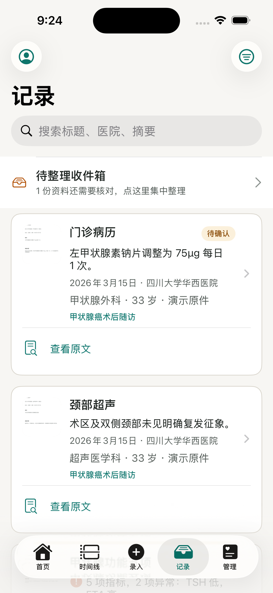
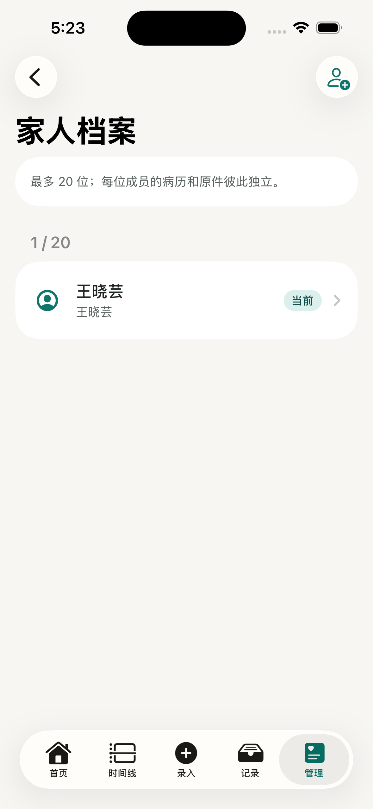
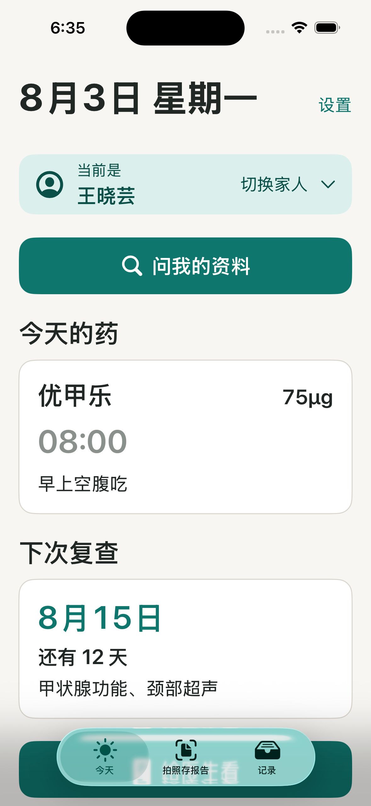
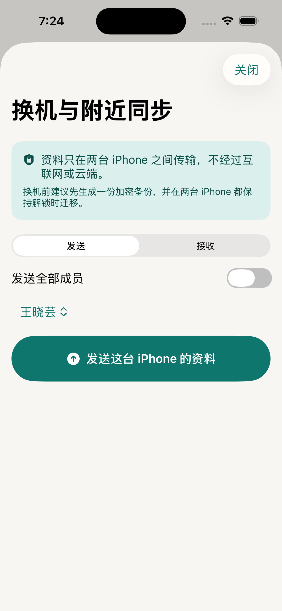

# CareThread

CareThread 是一款纯原生 iOS 本地病程资料整理工具。它把病历、处方、化验单、发票、用药和复查事项整理成按成员隔离的时间线，提供标准版与大字版两种完整交互模式。

> 一期 M0–M9 已完成并通过模拟器总验收。App 不提供诊断或治疗建议；当前代码不连接服务器、不上传病历，也不包含真实医疗测试数据。

## 一期功能地图

| 能力 | 目标 | 状态 |
|---|---|---|
| 多成员管理 | 最多 20 位家人，数据、原件、提醒、导出和对比严格隔离 | 完成 |
| 本地 OCR | Apple Vision 离线识别病历、手写处方、化验单和发票 | 引擎完成 |
| 姓名归属闸门 | OCR 姓名错配时阻止直接入库；仅经明确二次确认可覆盖并留审计 | 完成 |
| 病程时间线 | 日期、病种/类型、医院、医生、事件年龄组合筛选与稳定分页 | 完成 |
| 多报告/多页导入 | 一次导入多份报告和多页/多截图，用户分组为权威、OCR 辅助建议 | 完成 |
| 重复资料拦截 | 原件 SHA 硬拦截，重拍/裁边视觉指纹与多页 OCR 重叠软提示，确认前复扫 | 完成 |
| 原件 Vault | 不可变原件、高清查看、完整性校验、安全副本与恢复 | 完成 |
| 提醒 | 用药/复查本地通知；可选、独立授权的系统日历写入 | 完成 |
| 导出与分享 | 单成员按 1/6 月、1/2/5/10 年或全部生成 PDF，经系统分享面板发送 | 完成 |
| PDF 品牌钩子 | 页首横线/Logo/产品名，末段介绍与可扫描产品页二维码，URL 单点可替换 | 完成 |
| 本地对比 | 同成员两个阶段的指标和事实对比，不做诊断推断 | 完成 |
| 附近同步/换机 | 两台 iPhone 近场加密传输，支持单成员或全部成员 | 完成；无线发现真机待验 |
| 手动编辑与修订 | 所有业务内容可更正、查看修订并撤销；原件/OCR 证据不被覆盖 | 完成 |
| 就诊准备 | 一页准备卡、问题清单/笔记、重要置顶、补药与复查提醒 | 完成 |
| 双模式 | 标准版五槽导航与大字版三槽导航，关键能力完整可达 | 完成 |
| 外观主题 | 跟随系统、浅色、深色三档，标准版与大字版共享并持久化 | 完成 |

### 界面预览

| 资料记录 | 家人档案 | 大字版今天 | 附近同步 |
|---|---|---|---|
|  |  |  |  |

## 核心边界

- 一期使用 Swift、SwiftUI、SwiftData 和 Apple 原生框架，不引入跨端运行时。
- 二期 Android 只复用稳定 UUID、字段语义、版本化交换格式和领域协议；不反向牺牲 iOS 体验。
- 业务数据默认只保存在本机受保护容器。附近同步是用户主动触发的 Apple 本地设备传输，不经过互联网或自建服务器。
- 本期不使用 CloudKit、iCloud Documents 或 iCloud KVS 同步健康资料；Apple 审核规则 5.1.3(ii) 明确禁止 App 在 iCloud 存储个人健康信息。
- 真实 Vault 不直接暴露给 Files；用户保存、复制或分享的是明确标注的副本。
- 微信通过 iOS 系统分享面板成为可选目标，项目不集成微信 SDK。
- 系统日历可能按用户的系统账户同步，因此与纯本地通知分开授权和说明。

完整不变量见 [一期架构合同](docs/ARCHITECTURE_CONTRACT.md)。

## 工程结构

```text
CareThread/
├── App/                 # App 入口、根导航与模式切换
├── Core/
│   ├── Models/          # SwiftData 模型与稳定领域类型
│   ├── Capabilities/    # 版本与设备能力的唯一门禁
│   ├── Services/        # Vault、OCR、提取、查询等能力
│   └── DesignSystem/    # 颜色、字号、间距等设计 token
├── Features/            # 按业务流程拆分的 SwiftUI 功能
├── Resources/           # 本地化与 Assets
CareThreadTests/         # 单元与集成测试
CareThreadUITests/       # UI、无障碍与截图测试
Benchmarks/OCRBench/     # 完全虚构的离线 OCR 基准
Scripts/                 # 工程生成、验证与验收脚本
docs/                    # 架构、进度、验收和调研证据
```

## 环境要求

- Xcode 26.6；工程最低部署目标仍为 iOS 17.0。
- Xcode 必须安装 iOS 26.5 平台组件。缺失时可执行 `xcodebuild -downloadPlatform iOS`，完成后再确认 `xcrun simctl list runtimes` 能看到可用 iOS 运行时。
- UI 测试前关闭模拟器硬件键盘：`defaults write com.apple.iphonesimulator ConnectHardwareKeyboard -bool false`，避免 `typeText` 偶发丢失焦点。
- 安装 [XcodeGen](https://github.com/yonaskolb/XcodeGen) 与 `jq`。

`Scripts/verify.sh` 不再写死 iOS 18.6：它优先选择最新可用的 iPhone 16，缺少该机型时退回其他可用 iPhone，并在人机可读的诊断中列出 Xcode、运行时、设备和恢复建议。

## 本地构建与验证

```bash
xcodegen generate
Scripts/verify.sh
Scripts/acceptance.sh
```

OCR 复现实验：

```bash
Benchmarks/OCRBench/run.sh
```

`verify.sh` 负责构建与全部单元/UI 测试；最新完整复跑为 651/651 单元与集成测试、50/50 XCUITest，0 失败、0 跳过。`acceptance.sh` 还会校验提交轨迹、23 项边界映射、46 张生产导航截图、走查证据、依赖/联网/隐私红线和干净工作树。OCR 基准只使用程序生成的虚构资料，详细证据见 [实施进度](docs/PROGRESS.md)。

## 里程碑

| 里程碑 | 内容 | 状态 |
|---|---|---|
| M0 | 工程骨架、设计 token、标准版/大字版根导航 | 完成 |
| M1 | 数据层、Vault 基线、种子与压测数据 | 完成 |
| M2 | Apple Vision 离线 OCR 与规则提取 | 完成 |
| OCR 选型 | 31 张虚构样张、双引擎基准、唯一决策 | 完成 |
| M3–M7 | 多成员、录入、时间线、用药、提醒、导出、对比 | 完成 |
| Nearby | 单人/全员近场加密换机 | 完成；双真机无线待验 |
| M8–M9 | 备份、应用锁、完整大字版、无障碍、截图与总验收 | 完成 |

当前证据见 [实施进度](docs/PROGRESS.md)、[实施日志](docs/IMPLEMENTATION_LOG.md)、[截图清单](docs/SCREENSHOT_MANIFEST.json)和[人工走查证据](docs/MANUAL_WALKTHROUGH_EVIDENCE.json)。

## 文档导航

- [一期架构合同](docs/ARCHITECTURE_CONTRACT.md)：跨成员、安全、迁移、性能与原生平台边界
- [新增范围与验收追踪](docs/SCOPE_ADDENDUM.md)：用户追加能力的逐项验收口径
- [一期需求追踪表](docs/REQUIREMENTS_TRACEABILITY.md)：所有引导要求到实现、测试和证据的编号清单
- [附近同步与换机设计](docs/NEARBY_SYNC_DESIGN.md)：Network.framework 技术决策、安全协议和双机验收
- [多报告与多页导入设计](docs/MULTIPAGE_IMPORT_DESIGN.md)：批次、文档、页面分组与姓名证据聚合
- [国内外社区用户需求调研](docs/USER_NEEDS_RESEARCH.md)：公开需求证据、一期采纳能力与拒绝项
- [开源、版权与可持续发展策略](docs/OPEN_SOURCE_AND_SUSTAINABILITY_STRATEGY.md)：MIT、一次性买断、贡献权利链与出售路线
- [贡献规则](CONTRIBUTING.md)：当前 issue-only 阶段与未来 DCO/CLA 要求
- [品牌使用说明](TRADEMARKS.md)：MIT 代码许可与官方品牌身份的边界
- [Privacy Manifest 复核](docs/PRIVACY_MANIFEST.md)：零收集声明与 required-reason API 对照
- [实施进度](docs/PROGRESS.md)：里程碑状态与真机待验项
- [实施日志](docs/IMPLEMENTATION_LOG.md)：阶段过程、验证命令和查漏记录
- [阻塞与降级](docs/BLOCKERS.md)：只记录无法在当前环境闭环的事项
- [OCR 选型报告](docs/调研报告_OCR选型.md)：离线候选、评分、门槛和集成结论
- [App Store 上架资质报告](docs/调研报告_个人开发者上架AppStore.md)：中国大陆个人开发者的官方证据链

## 开发约束

- 不删除或弱化测试来换取通过。
- 功能 UI 使用设计 token，不在业务视图写裸色值。
- 不引入白名单外依赖；GPL/AGPL 依赖禁止进入项目。
- 日志、截图、测试和公开仓库不得包含真实姓名、病历、凭据或本机绝对路径。
- 每个里程碑先更新 README/进度文档、跑绿验证，再独立提交和推送。

## 免责声明

CareThread 只帮助用户保存和整理资料。OCR 与本地对比可能出错，展示内容须由用户核对；任何医疗决定都应咨询具备资质的专业人员。

## 许可证

当前代码以 [MIT License](LICENSE) 开源。MIT 允许使用、修改、分发、再许可和商业使用，但必须保留版权与许可声明。CareThread 名称、App 图标和官方商店身份不因 MIT 自动授权，详见 [品牌使用说明](TRADEMARKS.md)。项目采用“免费开源建立信任 → 官方 App Store 一次性买断 → 达标后出售完整产品资产”的唯一发展路线，详见[可持续发展策略](docs/OPEN_SOURCE_AND_SUSTAINABILITY_STRATEGY.md)。
